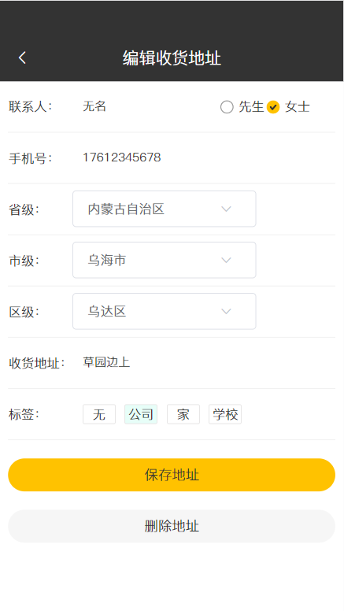
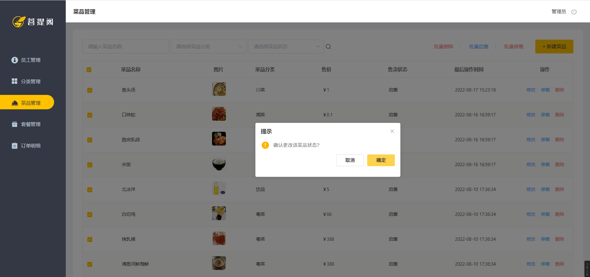

# 简介
本项目参照瑞吉外卖从零搭建到最终完善，依照个人编码风格规范，在一些代码细节方面进行了优化调整，
改写了业务逻辑的三层架构、异常集中处理和拦截器处理，
改进了前端页面交互并实现了一些新功能，如批量操作、订餐数量增减、地址三级联动及其他相关优化，
解决了一些业务逻辑判断的隐藏BUG。
# 演示
## 虚拟机配置
### 准备两台虚拟机，可以先配置一台主虚拟机，安装完编程环境后，克隆生成另一台虚拟机
  

### 虚拟机ip地址  

### 设置虚拟机静态ip  

### 虚拟机环境  

### 开放防火墙端口  

### 主从数据库配置
#### 主数据库状态

#### 设置从数据库状态

#### 查看从数据库

### Redis设置
#### Redis启动

#### Redis图形界面工具

## 项目配置
### YML文件

### 项目执行
## 移动端
### 用户登录

### 手机验证码

### 菜品展示

### 点餐

### 购物车

### 下单

### 地址列表

### 编辑地址

### 下单成功

### 查看订单

### 用户信息

## 管理端
### 登录页面

### 餐饮分类

### 菜品管理

### 批量操作

### 套餐管理

### 订单管理

### 员工管理

# 阶段总结
## 管理端
### 初步构建
+ 完成项目需求设计（项目概述、角色设置、原型展示、数据库建立） 
+ 前端框架布局 
+ 登录功能实现并测试 
+ 页面渲染调用分析
### 登录模块
+ 实现登录拦截，使用过滤器，设置白名单、路径匹配函数 
+ 设计拦截逻辑，如果未登录，则返回未登录结果，通过输出流方式向客户端页面响应数据
### 员工管理
 + 员工注册模块 
 + 员工修改模块 
 + 员工多条件动态查询模块，使用mybatis-plus接口更方便灵 
活 
 + 统一异常管理，设置异常拦截处理器，减少系统耦合度 
 + 配置消息格式转换器，如前端js的Long精度不够 
 + 将过滤器重构为为拦截器，集中控制 
 + 前后端数据格式统一处理再优化更新 
 + 员工管理界面css美化 
 + 前端页面js交互便捷优化 
 + 解决@RequestBody的使用问题，只能用于Post请求提交，若为Get请求时，可不加注解
### 菜品管理，异常管理
 + 数据结构调整优化 利用HashMap优化异常处理器业务逻辑，去掉多重if-else 
 + java类型中Long进行比较时，位数较长会失真，较小的数可以比较，建议用equals方法 
 + 利用线程获取统一执行流上设置的局部变量 
 + 对前后端参数传递多种方式深入认识  
  @RequestParam：绑定单个，json中变量绑定到java变量  
  @RequestBody：绑定对象按名严格 对应，只能post请求  
  @PathVariable：路径中获取 不加注解：按名对应 
 + 消息格式转换器，传到前端化为json格式String类型， 
 传到后端id自动化为Long型 
 + 使用Mybatis-Plus的自定义对象处理器接口，实现填充公共字段功能，简化代码开发 
 + 前端样式改进优化，更人性化 
 + 解决修改业务的BUG，复杂查重数据的逻辑处理
### 菜品管理完善
* 菜品管理模块完成并改善 
* 前端多条件动态查询界面调整优化
* 图片上传下载功能及其文件异常管理 
* 添加菜品，与菜品口味表一起操作，加入数据库事务功能 
* 菜品多条件动态分页查询
* 修改菜品，多表操作，加入自定义数据传输对象
### 套餐管理
* 套餐管理模块，删除套餐时涉及的关联表也要删除，多条件动态查询功能，添加套餐时涉及的关联表业务逻辑处理
* 前端批量操作按钮的功能实现
* 拦截器配置更新，修改了代码逻辑漏洞
* 移动端模块使用阿里云的短信通信服务，发送手机验证码并验证登录
## 移动端
### 主页展示，订单业务
* 移动端展示分类别菜品和套餐
* 订单业务流共能实现
* 改进前端交互，检查代码问题并处理
### 地址管理，订单管理完善
* 省市区三级联动及优化交互过程
* 查看历史订单
## 项目优化策略
### Redis缓存优化，减少数据库查询，整合SpringCache
### 主从数据库配置，读写分离优化
### Swagger生成接口文档信息
### Nginx反向代理实现负载均衡